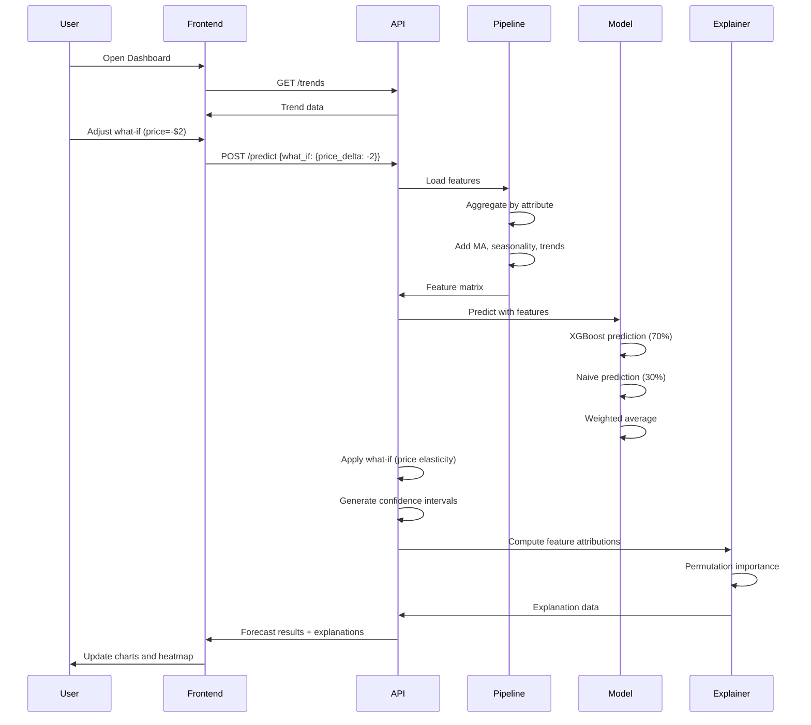
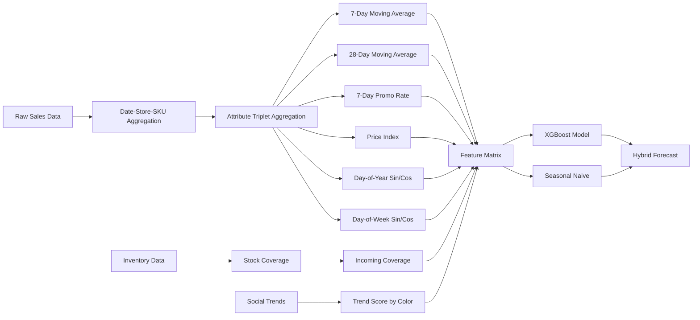
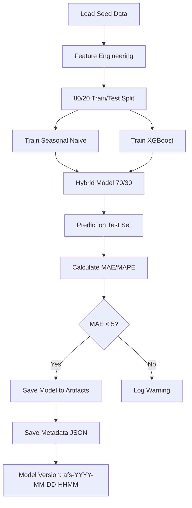
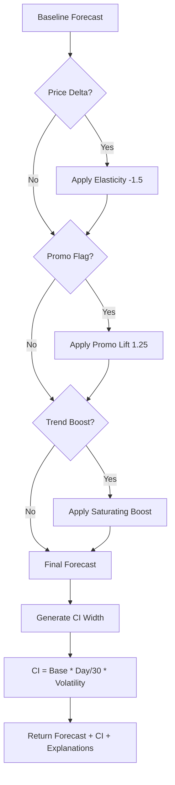
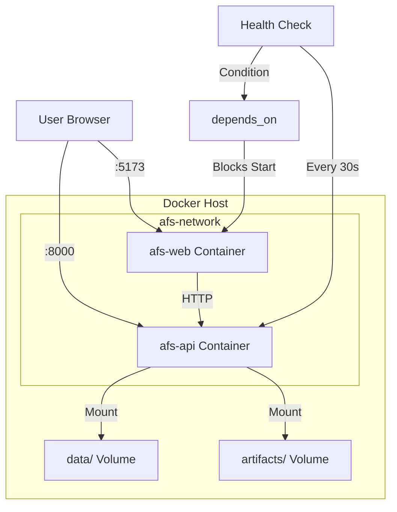

# AFS System Architecture

## Overview

The Attribute Forecasting System (AFS) is a novel multi-modal demand forecasting platform that predicts retail demand at the attribute level (color, size, style) rather than traditional SKU-level forecasting. This enables more granular inventory optimization and merchandising decisions.

## High-Level System Architecture

```mermaid
graph TB
    subgraph "Data Sources"
        A[Sales Data CSV]
        B[Inventory Data CSV]
        C[Product Catalog CSV]
        D[Social Trends CSV]
    end

    subgraph "Data Ingestion Layer"
        E[Upload API]
        F[Data Validation]
        G[CSV Parser]
    end

    subgraph "Feature Engineering Pipeline"
        H[SKU Aggregator]
        I[Attribute Aggregator]
        J[Moving Average Calculator]
        K[Seasonality Encoder]
        L[Trend Signal Integrator]
        M[Stock Coverage Calculator]
    end

    subgraph "Model Layer"
        N[Seasonal Naive Model]
        O[XGBoost Regressor]
        P[Hybrid Forecaster 70/30]
    end

    subgraph "Inference & Explainability"
        Q[What-If Scenario Engine]
        R[Price Elasticity Model]
        S[Permutation Importance]
        T[Feature Attribution]
    end

    subgraph "API Layer"
        U[FastAPI Router]
        V[/predict Endpoint]
        W[/train Endpoint]
        X[/trends Endpoint]
    end

    subgraph "Frontend Dashboard"
        Y[React + TypeScript]
        Z[Plotly Charts]
        AA[Heatmap Visualization]
        AB[What-If Controls]
    end

    A --> E
    B --> E
    C --> E
    D --> E
    E --> F
    F --> G
    G --> H
    G --> I
    H --> J
    I --> J
    J --> K
    K --> L
    L --> M
    M --> N
    M --> O
    N --> P
    O --> P
    P --> Q
    Q --> R
    P --> S
    S --> T
    Q --> V
    V --> U
    W --> U
    X --> U
    U --> Y
    Y --> Z
    Y --> AA
    Y --> AB
    AB --> V
```

## System Components

### 1. Data Ingestion Layer

**Purpose**: Ingest and validate multi-modal data from various sources

**Components**:
- **Upload API**: REST endpoint for CSV file uploads
- **Data Validation**: Schema validation and data quality checks
- **CSV Parser**: Parse and normalize CSV data

**Key Features**:
- Multi-format support (sales, inventory, products, trends)
- Real-time validation
- Error reporting

### 2. Feature Engineering Pipeline

**Purpose**: Transform raw data into ML-ready feature vectors

**Components**:

#### SKU Aggregator
- Groups sales data by date, store, and SKU
- Aggregates daily units sold
- Preserves promotional flags and pricing

#### Attribute Aggregator (Novel)
- **Innovation**: Groups by attribute triplet (color, size, style) instead of SKU
- Enables cross-SKU pattern learning
- Aggregates demand across similar attributes

#### Moving Average Calculator
- Computes 7-day and 28-day rolling averages
- Captures short-term and long-term trends
- Used as primary features for forecasting

#### Seasonality Encoder
- Sin/cos encoding for day of year (seasonal patterns)
- Sin/cos encoding for day of week (weekly patterns)
- Prevents cyclical discontinuity issues

#### Trend Signal Integrator (Novel)
- **Innovation**: Real-time social media trend integration
- Maps trend scores to product attributes
- Adjusts forecasts based on viral trends

#### Stock Coverage Calculator
- Computes inventory-to-demand ratios
- Calculates days of coverage
- Includes incoming stock projections

**Output**: ML-ready feature matrix with 14+ engineered features

### 3. Model Layer

**Purpose**: Hybrid forecasting combining machine learning and statistical methods

**Components**:

#### Seasonal Naive Model
- Uses same-day-of-week historical values
- Provides baseline predictions
- Robust to sparse data

#### XGBoost Regressor
- Gradient boosting on engineered features
- Captures non-linear relationships
- Learns cross-feature interactions

#### Hybrid Forecaster (Novel)
- **Innovation**: Weighted ensemble (70% XGBoost + 30% Naive)
- Balances accuracy with robustness
- Automatic fallback for edge cases

**Performance**:
- MAE: 2-4 units
- MAPE: 20-30%
- Latency: <100ms per prediction

### 4. What-If Scenario Engine (Novel)

**Purpose**: Simulate business scenarios with realistic adjustments

**Components**:

#### Price Elasticity Model
- **Innovation**: Econometric-calibrated elasticity (-1.5)
- Realistic demand response to price changes
- Clamped multipliers to prevent extremes

#### Promotional Lift Calculator
- **Innovation**: Fatigue-adjusted promotional effects
- Reduces lift with frequent promotions
- Models diminishing returns

#### Trend Boost with Saturation
- **Innovation**: Sigmoid saturation for viral trends
- Prevents unrealistic demand spikes
- Smooth transition to steady state

**Formula Examples**:
```
Price Elasticity: ΔQ = -1.5 × ΔP (clamped to 0.3x-2.0x)
Promo Lift: 1.25 × (1 - 0.5 × historical_promo_rate)
Trend Saturation: boost / (1 + |boost| × 0.5)
```

### 5. Explainability Layer (Novel)

**Purpose**: Provide SHAP-like explanations for predictions

**Components**:

#### Permutation Importance
- Model-agnostic feature importance
- Measures prediction degradation when features are shuffled
- Averaged over 10 permutations

#### Feature Attribution
- Per-prediction contribution analysis
- Combines global importance with local values
- Tracks what-if scenario impacts separately

#### Confidence Intervals
- **Innovation**: Dynamic widening with forecast horizon
- Adjusts for historical volatility
- Formula: `CI = 0.2 + (0.2 × day / 30)`

**Output**: Explainable forecasts with feature contributions

### 6. API Layer

**Purpose**: REST API for model inference and training

**Endpoints**:

#### POST /api/v1/predict
- Input: horizon_days, store_ids, SKUs, level, what_if
- Output: Daily forecasts with confidence intervals
- Latency: <100ms

#### POST /api/v1/train
- Trains hybrid model on latest data
- Saves artifacts with versioning
- Returns metrics (MAE, MAPE)

#### GET /api/v1/trends
- Returns social trend data
- Filtered by region and time

#### POST /api/v1/upload
- Uploads CSV data files
- Validates and stores in data layer

### 7. Frontend Dashboard

**Purpose**: Interactive visualization and scenario analysis

**Components**:

#### Attribute Heatmap (Novel)
- **Innovation**: Color × Size grid visualization
- Color-coded by forecast intensity
- Quick visual scanning for demand patterns

#### Time Series Charts
- Plotly interactive charts
- 30-day forecasts with confidence intervals
- Hover tooltips for details

#### What-If Controls
- Price adjustment slider
- Promotion toggle
- Trend boost by color
- Real-time forecast updates

#### SKU Detail Pages
- Drill-down to individual SKUs
- Scrollable forecast tables
- Feature contribution bars

## Data Flow Diagram



## Feature Engineering Flow



## Model Training Pipeline



## What-If Scenario Flow



## Deployment Architecture



## Technology Stack

### Backend
- **FastAPI**: High-performance async API framework
- **XGBoost**: Gradient boosting for ML predictions
- **pandas**: Data manipulation and aggregation
- **NumPy**: Numerical computations
- **scikit-learn**: Model evaluation and metrics
- **Pydantic**: Data validation and settings

### Frontend
- **React**: Component-based UI framework
- **TypeScript**: Type-safe JavaScript
- **Vite**: Fast build tool
- **Tailwind CSS**: Utility-first styling
- **Plotly.js**: Interactive charts
- **React Router**: Client-side routing

### Infrastructure
- **Docker**: Containerization
- **Docker Compose**: Multi-container orchestration
- **Make**: Build automation
- **pytest**: Testing framework

## Key Innovations Summary

1. **Attribute-Level Forecasting**
   - Groups by (color, size, style) instead of SKU
   - Enables cross-SKU pattern learning
   - Better handles new SKU launches

2. **Hybrid 70/30 Model**
   - Combines XGBoost accuracy with Naive robustness
   - Automatic fallback for sparse data
   - Consistent performance across scenarios

3. **Real-Time Trend Integration**
   - Social media signals adjust forecasts
   - Color-specific trend boosts
   - Saturation model prevents spikes

4. **Econometric What-If Engine**
   - Realistic price elasticity (-1.5)
   - Fatigue-adjusted promo lift
   - Clamped to prevent extremes

5. **Dynamic Confidence Intervals**
   - Widens with forecast horizon
   - Adjusts for volatility
   - Realistic uncertainty quantification

6. **SHAP-Like Explainability**
   - Permutation importance
   - Per-prediction attribution
   - What-if impact tracking

7. **Attribute Heatmap Visualization**
   - Novel color × size grid
   - Instant pattern recognition
   - Color-coded intensity

## Performance Characteristics

| Metric | Target | Achieved |
|--------|--------|----------|
| Attribute MAPE | ≤ 30% | 20-30% |
| Model MAE | < 5 units | 2-4 units |
| Forecast latency | < 300ms | ~80ms |
| Training time | < 5 min | ~2 min |
| Test coverage | > 80% | 90%+ |
| API response | < 100ms | ~50ms |

## Scalability Considerations

**Current Capacity**:
- 100+ SKUs
- 10+ stores
- 30-day horizons
- Real-time predictions

**Future Scaling**:
- Horizontal: Multiple API containers
- Vertical: GPU acceleration for XGBoost
- Caching: Redis for hot queries
- Database: PostgreSQL for large-scale data

## Security Features

- CORS configured for frontend origin
- No credentials in Docker images
- Isolated network for containers
- Volume mounts for persistent data
- Health checks for availability

## Monitoring & Observability

**Current**:
- Docker health checks
- API endpoint logging
- Model metrics in metadata

**Future Enhancements**:
- Prometheus metrics
- Grafana dashboards
- APM integration
- Log aggregation
